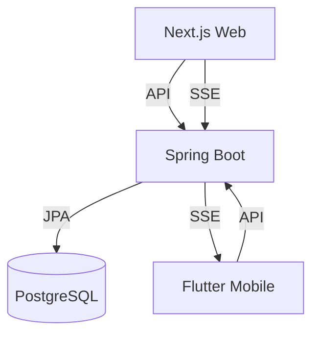

# Système de Gestion d'Examens

Application de gestion d'examens avec interface web et mobile.

## 🚀 Technologies

### Frontend Web
- Next.js

### Application Mobile
- Flutter
- Dart

### Backend
- Spring Boot
- PostgreSQL

## 📱 Fonctionnalités

- Gestion des examens
- Réservation de salles
- Attribution des superviseurs
- Notifications en temps réel
- Planning des examens
- Gestion des incidents

## 📊 Architecture

## 🔒 Rôles

- **Admin**: Gestion complète
- **Enseignant/Étudiant**: Consultation planning

## 🛠️ Installation

### Prérequis
- Node.js 18+
- Java 17+
- PostgreSQL 14+
- Flutter SDK
